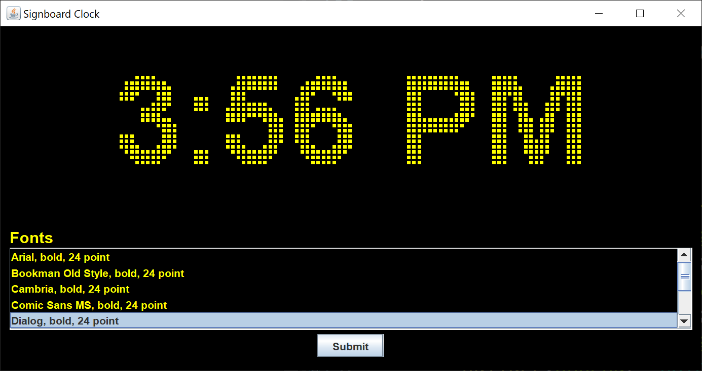

# Signboard Clock

## Introduction

I was browsing YouTube when I came across this [mechanical marble clock](https://www.youtube.com/watch?v=8IF4esSNA3k) that the content creator was making by using 3D printer plastic. I was inspired to create a signboard clock.

A signboard is an electronic signboard used to display text messages.  The letters of the message move from left to right across the signboard.  The signboard comprises a two-dimensional array of light-emitting diodes that display one or more colors.  Older signboards used incandescent bulbs, which had to be periodically checked and replaced.

Some people, including myself until recently, refer to signboards as marquees.  A marquee is a rooflike structure, often bearing a signboard, projecting over an entrance, as to a theater or hotel.

Here's the Swing GUI that I came up with.

You can't see the motion in a still picture.  When the GUI first starts, all of the diodes (pixel squares) light up for three seconds to allow the operator to check for burnt-out bulbs.  The time slides in from the left.  Just before the minute changes, the old time display slides out to the right.

The first minute the clock runs can be erratic, depending on when you started the GUI.  The clock runs well after the first full minute of operation. 

You can choose from any of the listed fonts.  Change the font by selecting the font you want and left-clicking the Submit button.  The clock works best when you change the font while the time is displayed, not moving.

## Explanation

Oracle has a helpful tutorial, [Creating a GUI With Swing](https://docs.oracle.com/javase/tutorial/uiswing/index.html).  Skip the Learning Swing with the NetBeans IDE section.

I chose to make the background of the GUI black and the foreground yellow.  I find these colors easier on my eyes than a light background and dark foreground.

When I create a Swing GUI, I use the [model-view-controller](https://en.wikipedia.org/wiki/Model%E2%80%93view%E2%80%93controller) (MVC) pattern. This pattern allows me to separate my concerns and focus on one part of the application at a time.

A Swing model consists of one or more plain Java getter/setter classes.

A Swing view consists of one `JFrame` and as many `JPanels` and `JDialogs` as you need.

Each Swing `Action` or `Listener` is its own controller. There's usually not one controller to "rule them all".

### Model

I created two model classes for this application.

The `SignboardFont` class holds one of the possible signboard fonts.  This class also calculates the maximum width and height of the characters in the font in pixels.  The maximum width is defined using the `String` "12:58 AM", which should be the widest string to be displayed.  The `String` is translated into pixels using a `BufferedImage`.  The `BufferedImage` is scanned and translated into a two-dimensional `boolean` array, which is the output used to drive the signboard display. 

The `SignboardClockModel` class holds a `DefaultListModel` of `SignboardFont` instances, the default `SignboardFont` instance, a `LocalDateTime` current time, and a `DateTimeFormatter` formatter.  The maximum width and height of all the possible fonts are calculated to determine the dimensions of the signboard.  You can add or subtract fonts from the list of fonts, depending on which fonts are available on your computer. 

### View

I created three view classes for this application.

The `ControlPanel` class creates the control `JPanel` that allows you to select a font from a list of fonts.  The possible fonts are displayed in a `JList`.

The `SignboardPanel` class extends a `JPanel` so we can override the `paintComponent` method and draw the pixels of the signboard.

The `SignboardClockFrame` class creates a `JFrame` to hold the control `JPanel` and the signboard drawing `JPanel`.  This class runs the animation to display all of the lights for three seconds and creates the `Timer` that checks the current time every five seconds.

### Controller

I created five controller classes for this application.

The `DisplayAllPixelsListener` class implements an `ActionListener` interface and displays all pixels for three seconds.

The `ClockListener` class implements an `ActionListener` interface and is the main loop of the application.  This class gets the current time every five seconds.  This class also implements an anonymous inner `ActionListener` class that shifts the time display to the right and off the signboard near the end of a minute.

The `ShiftTimeInListener` class implements an `ActionListener` interface and shifts the time display to the right and onto the signboard after the minute changes.

The `SetDefaultFontListener` class implements an `ActionListener` interface and sets the default font to the selected font.
